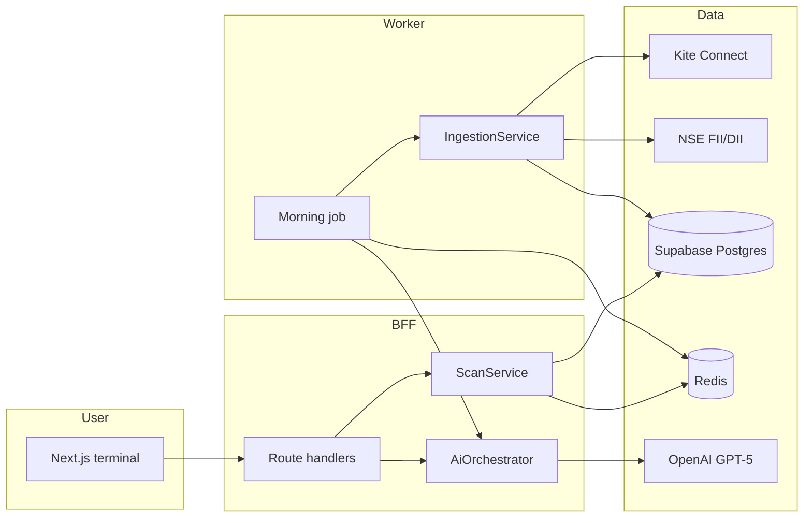
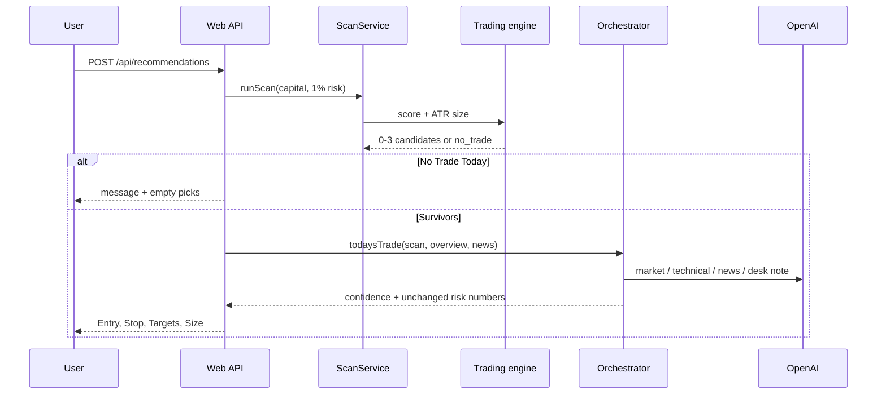

# Architecture

## Design decisions

1. **AI is a narrator, not a calculator.** Indicators and risk live in `@bloomstock/trading`. The orchestrator is forbidden from recomputing them. If the model drifts more than 5% on position size, confidence is cut.
2. **Next.js is the BFF.** User-facing REST lives in App Router handlers. Long ingest is a worker (`apps/api`) because 2,000 daily histories do not belong in a serverless request.
3. **Repository + service + DI.** Route handlers never talk SQL. They call `getContainer()`.
4. **Fail closed on missing market data.** No synthetic Nifty, no random RSI. Empty UI and typed `MarketDataError` instead.
5. **Prompt templates are data.** Versioned rows in Postgres, one active version per slug.

## Runtime diagram



## Today's Best Trade sequence



## Swing rules (hard)

- Close above EMA20 and EMA50
- RSI 55–70
- MACD line above signal and histogram > 0
- Volume ≥ 1.5× 20-day average
- Recognized structure: breakout, flag, cup-handle, or ascending triangle
- Minimum 1:2 reward, preferred 1:3
- Bearish regime short-circuits the universe

## Risk engine

```
riskAmount = capital * riskPercent / 100
stop = entry - 1.5 * ATR
size = floor(riskAmount / (entry - stop))
t1 = entry + 2 * (entry - stop)
t2 = entry + 3 * (entry - stop)
trail = entry - 1 * ATR
```

Example: capital 100000, risk 1%, entry 1000, ATR 20 → risk 1000, stop 970, size 33, t1 1060, t2 1090.

## Tradeoffs

| Choice                  | Why                               | Cost                                      |
| ----------------------- | --------------------------------- | ----------------------------------------- |
| Kite as primary         | Official NSE cash + index quotes  | Daily access-token rotation               |
| Alpha Vantage secondary | Helps with adjusted daily history | Rate limits, weaker NSE master            |
| In-process rate limiter | Zero-ops on Vercel                | Use Redis limiter at multi-instance scale |
| Pattern heuristics      | Deterministic, testable           | Not a full computer-vision pattern engine |
