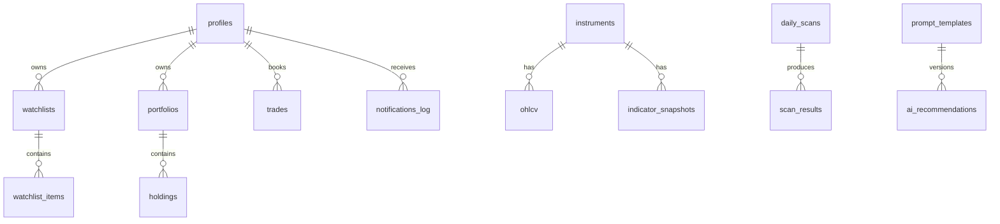

# Database

PostgreSQL via Supabase. Auth identities live in `auth.users`. Application tables live in `public` with RLS.



## Tables

| Table                          | Purpose                                     |
| ------------------------------ | ------------------------------------------- |
| `profiles`                     | Capital, 1% risk, notify flags, role        |
| `instruments`                  | NSE/BSE master                              |
| `ohlcv`                        | Raw candles, composite PK                   |
| `indicator_snapshots`          | Backend-computed EMA/RSI/MACD/ATR/BB/volume |
| `fii_dii_data`                 | Daily cash-market flows                     |
| `market_overviews`             | Latest Nifty/VIX/regime JSON                |
| `daily_scans` / `scan_results` | Scanner output                              |
| `prompt_templates`             | Versioned prompts, one active per slug      |
| `ai_recommendations`           | Audit of desk notes                         |
| `news`, `ipo_issues`           | Catalysts                                   |
| `vendor_secrets`               | Encrypted Kite (and future vendor) tokens   |
| `audit_logs`                   | Mutating API actions                        |

## Constraints worth knowing

- Trades are long-only; `stop_loss < entry < target_1 <= target_2`
- Risk percent `> 0` and `<= 5`
- Unique active prompt per slug
- New auth users get a Default watchlist and Primary portfolio

## Migrations

Apply in order:

1. `0001_init.sql`
2. `0002_prompt_templates.sql`
3. `0003_market_overviews.sql`
4. `0004_vendor_secrets.sql`
5. `0005_rls_public_tables.sql`
6. `0006_secure_functions.sql`

`set_updated_at` pins `search_path`. `handle_new_user` stays `SECURITY DEFINER` for the `auth.users` trigger, but `EXECUTE` is revoked from `anon` / `authenticated` so it cannot be called via `/rest/v1/rpc`. Market tables (`instruments`, `ohlcv`, `indicator_snapshots`, `fii_dii_data`, `news`, `daily_scans`, `scan_results`, `ipo_issues`, `market_overviews`) have RLS on with authenticated `SELECT` only. `prompt_templates` and `vendor_secrets` have RLS on with no anon/authenticated policies, so only the service role can read them. `ipo_issues` is unique on `(symbol, open_date)` so the morning job can upsert the NSE calendar.

```bash
supabase db push
```
